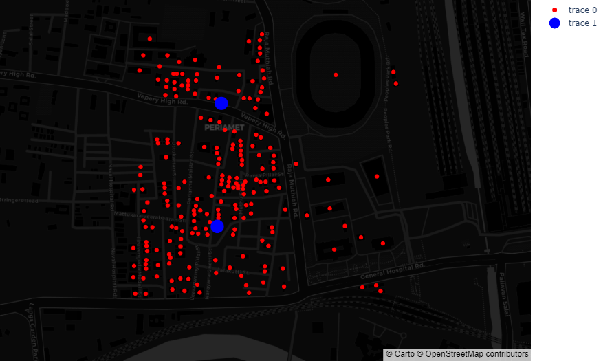
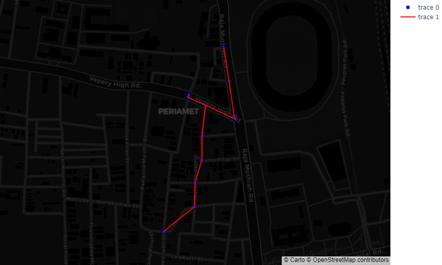

## Generating synthetic feeder using OpenStreet data

**Developed by: [Kapil Duwadi](https://github.com/KapilDuwadi), 2022-07-31**

In this tutorial you will build synthetic feeder for Chennai, India. 
You will perform following tasks to achieve final goal.

### <p style="color:green">1. Preparing sandbox environment </p>

To proceed with this tutorial, let's create a `sandbox` environment. 
It will take about a minute to make the environment ready.

[Create a sandbox :fontawesome-brands-python:](https://mybinder.org/v2/gh/NREL/shift/develop){ .md-button .md-button--primary target:_blank }


??? "Verify the screen you are seeing."

    { width: 300}

???+ "Creating your own environment (optional)" 

    If you encounter problem launching sandbox or prefer using jupyter notebook in 
    your own computer please follow the following steps. In windows we recommend
    using `Anaconda` or `Miniconda` to create the environment. 

    If you need help installing `Anaconda` please follow the instructions 
    [here](https://www.anaconda.com/products/distribution). 

    === ":fontawesome-brands-windows: Windows 10"

        ``` cmd
        conda create -n shift python==3.9
        conda activate shift
        conda install -c conda-forge osmnx
        git clone https://github.com/NREL/shift.git
        cd shift
        pip install -e.
        pip install jupyterlab
        jupyter lab
        ```

    === ":fontawesome-brands-apple: + :fontawesome-brands-linux: Mac OS & linux"

        ``` cmd
        conda create -n shift python==3.9
        conda activate shift
        git clone https://github.com/NREL/shift.git
        cd shift
        pip install -e.
        pip install jupyterlab
        jupyter lab
        ```
!!! tip
    If you are using python virtual environment make sure you have 
    `python 3.9 or greater` installed in your system.

Click on `+` symbol or Python Kernel to create a Jupyter Notebook.

!!! success "You have sucessfully created an environment."

---
### <p style="color:green"> 2. Get all the buildings data and create geometry object for all buildings. </p>

Let's get all the geometries from Chennai, India. Copy and paste the following code 
in your jupyter notebook.

```python
from shift.geometry import BuildingsFromPlace
g = BuildingsFromPlace("Chennai, India", max_dist=300)
geometries = g.get_geometries()
print(f"Total number of buildings: {len(geometries)}" +
f"\nSample geometry: {geometries[0]}")
```

??? "Verify the output you are seeing."

    ``` 
    Total number of buildings: 216
    Sample geometry: Building( Latitude = 13.081990729184426,  Longitude = 80.27267988235701, Area = 4.81)
    ```

!!! success "You have sucessfully fetched all the buildings."

---
### <p style="color:green"> 3. Convert building geometries into load objects </p>

In order to create power system loads from geometries we need to tell 
how to assign phases, voltages and connection type for loads. In this 
case let's use `RandomPhaseAllocator` class to allocate phases to all 
geometries. Here we are saying all geometries are of single phase type 
and there are no two phase and three phase loads and finally pass all 
the geometries.

Similarly we initialize simple voltage setter by passing line to line 
voltage of 13.2 kV. `DefaultConnSetter` class is created which will 
set the connection type to `wye` for all geometries.

```python
from shift.load_builder import (RandomPhaseAllocator, 
                                SimpleVoltageSetter, DefaultConnSetter)
rpa = RandomPhaseAllocator(100, 0, 0, geometries)
svs = SimpleVoltageSetter(13.2)
dcs = DefaultConnSetter()
```

But wait how do we get power consumption data for the load. In order get consumption 
let's use building area info to get the kw. Let's say we know there is a piecewise 
linear function that relates building area with peak kW consumption.

```python
import matplotlib.pyplot as plt
import plotly.express as px
import pandas as pd

area_to_kw_curve = [(0,5), (10, 5.0), (20, 18), (50, 30)]

df = pd.DataFrame({
    'Area in meter square' : [x[0] for x in area_to_kw_curve],
    'Peak consumption in kW' : [x[1] for x in area_to_kw_curve]
})
fig = px.line(df, x="Area in meter square", y="Peak consumption in kW") 
fig.show()
```

??? "Verify the output you are seeing."

    

In order to use this piecewise linear function we can invoke 
`PiecewiseBuildingAreaToConsumptionConverter` class from load_builder 
and pass it as an argument to build the load. Let's see this class in action.

```python
from shift.load_builder import PiecewiseBuildingAreaToConsumptionConverter
pbacc = PiecewiseBuildingAreaToConsumptionConverter(area_to_kw_curve)
area = 15
print(f"For area of {area} m^2 the consumption would be {pbacc.convert(area)}")
```

??? "Verify the output you are seeing."

    ``` 
    For area of 15 m^2 the consumption would be 11.5
    ```

Let's build the loads from the geometries and print one them. Here let's try to
build constant power factor of 1.0 type loads for simplicity.

```python
from shift.load_builder import ConstantPowerFactorBuildingGeometryLoadBuilder
from shift.load_builder import LoadBuilderEngineer
loads = []
for g in geometries:
    builder = ConstantPowerFactorBuildingGeometryLoadBuilder(g, 
                            rpa, pbacc, svs, dcs, 1.0)
    b = LoadBuilderEngineer(builder)
    loads.append(b.get_load())
print(len(loads), loads[0], loads[1])
```

??? "Verify the output you are seeing."

    ```
    216 ConstantPowerFactorLoad(Name = 80.26965403477561_13.083734923972695_load, 
    Latitude = 13.083734923972695, Longitude = 80.26965403477561, Phase = Phase.BN 
    NumPhase = NumPhase.SINGLE, Connection Type = LoadConnection.STAR, kw = 5.0, 
    pf = 1.0, kv = 7.621) ConstantPowerFactorLoad(Name = 80.2680542788762_13.084093574520553_load, 
    Latitude = 13.084093574520553, Longitude = 80.2680542788762, Phase = Phase.BN NumPhase = 
    NumPhase.SINGLE, Connection Type = LoadConnection.STAR, kw = 5.0, pf = 1.0, kv = 7.621)
    ```

Let's visualize these loads on top of GIS map. That would be cool right ?. 
In order to do that let's invoke two layer distribution network first.

```python
from shift.feeder_network import (SimpleTwoLayerDistributionNetworkBuilder, 
                                  TwoLayerNetworkBuilderDirector)
from shift.network_plots import PlotlyGISNetworkPlot
from shift.constants import PLOTLY_FORMAT_CUSTOMERS_ONLY

network_builder = SimpleTwoLayerDistributionNetworkBuilder()
network = TwoLayerNetworkBuilderDirector(loads, [], [], [], network_builder)

API_KEY = None
p = PlotlyGISNetworkPlot(
        network.get_network(),
        API_KEY,
        'carto-darkmatter',
        asset_specific_style=PLOTLY_FORMAT_CUSTOMERS_ONLY
    )
p.show()
```

??? "Verify the output you are seeing."

    
!!! success "You have sucessfully converted buildings to power system loads."

---
### <p style="color:green"> 4. Use clustering algorithm to cluster loads </p>

Next step is to use clustering algorithm to figure out best location for 
positioning distribution transformers. Kmeans clustering is one way of 
doing this. Let's say we want to have 20 disribution transformers for this feeder.

```python
from shift.clustering import KmeansClustering
import numpy as np

x_array = np.array([[load.longitude, load.latitude] 
                    for load in loads])
cluster_ = KmeansClustering(2)
clusters = cluster_.get_clusters(x_array)
cluster_.plot_clusters()
```

??? "Verify the output you are seeing."

    

!!! success "You have sucessfully clustered the load objects."

### <p style="color:green">  5. Convert cluster center into distribution transformer objects </p>

Let's use clustering algorithm to position distribution transformers. 
In order to create transformers from clusters we need to provide list of loads, 
clustering object, kV and connection type for both high tension and low tension 
side of transformers along with number of phase to be used to design transformers. 
The diversity factor function, power factor and adjustment_factor is used to compute 
kVA capacity for the transformer. The catalog is used to find nearest 
transformer capacity.

```python
from shift.transformer_builder import (
    ClusteringBasedTransformerLoadMapper)
from shift.enums import (TransformerConnection, 
                         NumPhase, Phase)
from shift.constants import (
    PLOTLY_FORMAT_CUSTOMERS_AND_DIST_TRANSFORMERS_ONLY)

trans_builder = ClusteringBasedTransformerLoadMapper(
    loads,
    clustering_object = cluster_,
    diversity_factor_func = lambda x: 0.3908524*np.log(x) + 1.65180707,
    ht_kv = 13.2,
    lt_kv = 0.4,
    ht_conn = TransformerConnection.DELTA,
    lt_conn = TransformerConnection.STAR,
    ht_phase = Phase.ABC,
    lt_phase = Phase.ABCN,
    num_phase = NumPhase.THREE,
    power_factor=0.9,
    adjustment_factor=1.15
)
t  = trans_builder.get_transformer_load_mapping()

network = TwoLayerNetworkBuilderDirector(loads, 
            list(t.keys()), [], [], network_builder)
p = PlotlyGISNetworkPlot(
        network.get_network(),
        API_KEY,
        'carto-darkmatter',
        asset_specific_style=PLOTLY_FORMAT_CUSTOMERS_AND_DIST_TRANSFORMERS_ONLY
    )
p.show()
```

??? "Verify the output you are seeing."

    

!!! success "You have sucessfully created transformer objects."

### <p style="color:green"> 6. Get road network and create primary network </p>

Let's try to get road network from chennai india. We will convert the road 
network to undirected graph and use minimum spanning tree alogorithm to remove any loops. 

```python
from shift.graph import RoadNetworkFromPlace
from shift.constants import PLOTLY_FORMAT_SIMPLE_NETWORK
graph = RoadNetworkFromPlace('chennai, india', max_dist=300)
graph.get_network()
p = PlotlyGISNetworkPlot(
            graph.updated_network,
            API_KEY,
            'carto-darkmatter',
            asset_specific_style=PLOTLY_FORMAT_SIMPLE_NETWORK
        )
p.show()
```


??? "Verify the output you are seeing."

    

Let's create an instance of Primary Network Builder class and visulaize the generated network.

```python
from shift.primary_network_builder import PrimaryNetworkFromRoad
pnet = PrimaryNetworkFromRoad(
        graph,
        t,
        (80.2786311, 13.091658),
        lambda x: 0.3908524*np.log(x) + 1.65180707,
        13.2,
        100
    )
pnet.update_network_with_ampacity()
p = PlotlyGISNetworkPlot(
            pnet.get_primary_network(),
            API_KEY,
            'carto-darkmatter',
            asset_specific_style=PLOTLY_FORMAT_SIMPLE_NETWORK
        )
p.show()
```

??? "Verify the output you are seeing."

    

!!! success "You have sucessfully fetched road network and created primary network."

### <p style="color:green"> 7. Convert primary network into list of primary line sections </p>

Let's take above primary network and convert it into primary line sections.
```python
from shift.primary_network_builder import PrimarySectionsBuilder
from shift.enums import ConductorType, NumPhase
from shift.line_section import HorizontalThreePhaseConfiguration
from shift.feeder_network import update_transformer_locations
psections = PrimarySectionsBuilder(
    pnet.get_network(),
    ConductorType.OVERHEAD,
    {NumPhase.THREE: HorizontalThreePhaseConfiguration(9, 0.4, "m")},
    NumPhase.THREE,
    Phase.ABC,
    False,
    material="ACSR",
)
longest_length = pnet.get_longest_length_in_kvameter() / 1609.34
k_drop = 2 / (longest_length)
l_sections = psections.generate_primary_line_sections(k_drop, 11.0)
r_nodes = pnet.get_trans_node_mapping()
print(psections[0])
```

??? "Verify the output you are seeing."

    !!! note "The output may not be exactly the same which is okay as long as you are seeing something similar."
    ```
    GeometryBasedLine(Name = 80.2696283_13.0829503_node__80.2697735_13.08341_node, 
    FromNode = 80.2696283_13.0829503_node, ToNode = 80.2697735_13.08341_node, Length = 
    53.2391782199997 NumPhase = NumPhase.THREE, Length unit = m,  Geometry = OverheadLineGeometry(Name = 475b3162-f00e-4652-be27-cbf953c2b104_linegeometry, NumPhase = NumPhase.THREE, Number of conductors 
    = 3, Configuration = <shift.line_section.HorizontalThreePhaseConfiguration object at 0x000001DFDC312610>, 
    Phase wire = Wire(Name = 6_6/1_ACSR, Resistance unit = mi, GMR unit = ft, Radius unit = in, AC resistance (ohm per) 
    = 3.98, Diameter = 0.198, GMR AC = 0.00394, Ampacity = 100)))
    ```

!!! success "You have sucessfully created primary line sections."

### <p style="color:green"> 8. Update transformer objects to use nearest primary node from primary network </p>

After creating primary network we need to connect transformers to the primary network. To do this we 
can simply call `update_transformer_locations` function.

```python
t = update_transformer_locations(r_nodes, t, l_sections)
```

!!! success "You have sucessfully updated transformer locations. "

### <p style="color:green">  9. Develop secondary network and line sections for all transformer objects </p>

Let's take each transformer and it's load and convert it into secondary network. 

```python
from shift.secondary_network_builder import (SecondaryNetworkBuilder, 
    SecondarySectionsBuilder)
from shift.line_section import (HorizontalThreePhaseNeutralConfiguration, 
    HorizontalSinglePhaseConfiguration)
s_sections = []
counter = 0
load_to_node_mapping_dict = {}
for trans, cust_list in t.items():
    sn = SecondaryNetworkBuilder(cust_list, trans, 
        lambda x: 0.3908524*np.log(x) + 1.65180707, 0.4, f"_secondary_{counter}")
    sn.update_network_with_ampacity()
    load_to_node_mapping_dict.update(sn.get_load_to_node_mapping())
    k_drop = 5 / (200 * 2)
    sc = SecondarySectionsBuilder(
        sn.get_network(),
        ConductorType.OVERHEAD,
        {
            NumPhase.THREE: HorizontalThreePhaseNeutralConfiguration(
                9, 0.4, 9.4, "m"
            )
        },
        {
            NumPhase.SINGLE: HorizontalSinglePhaseConfiguration(9, "m"),
        },
        NumPhase.THREE,
        Phase.ABCN,
        True,
        material="ACSR"
    )
    s_sections.extend(sc.generate_secondary_line_sections(k_drop, 0.4))
    counter +=1
```
??? "Verify the output you are seeing."

    

!!! success "You have sucessfully created secondary line sections and network. "

### <p style="color:green"> 10. Create a substation transformer object </p>

Finally let's create a substation transformer.

```python
from shift.transformer_builder import SingleTransformerBuilder
s_node = pnet.substation_node
s_coords = pnet.substation_coords
sub_trans_builder = SingleTransformerBuilder(
    loads,
    s_coords[0],
    s_coords[1],
    diversity_factor_func=lambda x: 0.3908524 * np.log(x) + 1.65180707,
    ht_kv=33,
    lt_kv=11,
    ht_conn=TransformerConnection.DELTA,
    lt_conn=TransformerConnection.STAR,
    ht_phase=Phase.ABC,
    lt_phase=Phase.ABCN,
    num_phase=NumPhase.THREE,
    power_factor=0.9,
    adjustment_factor=1.15,
)
st = sub_trans_builder.get_transformer_load_mapping()
```

!!! success "You have sucessfully created substation transformer. "

### <p style="color:green"> 11. Export OpenDSS model </p>

Let's export distribution model in OpenDSS format.

```python
from shift.exporter.opendss import (
ConstantPowerFactorLoadWriter,
TwoWindingSimpleTransformerWriter,
GeometryBasedLineWriter,
OpenDSSExporter
)
lw = ConstantPowerFactorLoadWriter(
    loads, load_to_node_mapping_dict, "loads.dss"
)
tw = TwoWindingSimpleTransformerWriter(list(t.keys()), "dist_xfmrs.dss")
stw = TwoWindingSimpleTransformerWriter(list(st.keys()), "sub_trans.dss")
sw = GeometryBasedLineWriter(
    l_sections + s_sections,
    line_file_name="lines.dss",
    geometry_file_name="line_geometry.dss",
    wire_file_name="wiredata.dss",
    cable_file_name="cabledata.dss",
)


dw = OpenDSSExporter(
    [tw, stw, sw, lw],
    r"C:\Users\KDUWADI\Desktop\NREL_Projects\shift_output",
    "master.dss",
    "chennai",
    33.0,
    50,
    Phase.ABCN,
    NumPhase.THREE,
    f"{s_node.split('_')[0]}_{s_node.split('_')[1]}_htnode",
    [0.001, 0.001],
    [0.001, 0.001],
    [0.4, 11.0, 33.0],
)
dw.export()
```

!!! success "You have sucessfully created substation transformer. "