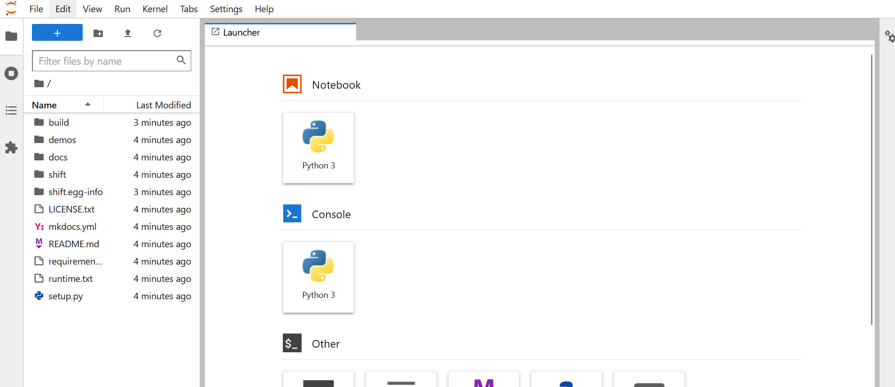

# Getting started

## Generating synthetic feeder using OpenStreet data

In this tutorial you will build synthetic feeder for Chennai, India. You will perform following tasks to achieve final goal.

### <p style="color:green">1. Preparing sandbox environment </p>

To proceed with this tutorial, let's create a `sandbox` environment. 
It will take about a minute to make the environment ready.

[Create a sandbox :fontawesome-brands-python:](https://mybinder.org/v2/gh/NREL/shift/develop){ .md-button .md-button--primary target:_blank }


??? "Verify the screen you are seeing."

    { width: 300}

???+ "Creating your own environment (optional)" 

    If you encounter problem launching sandbox or prefer using jupyter notebook in 
    your own computer please follow the following steps. In windows we recommend
    using `Anaconda` or `Miniconda` to create the environment. 

    If you need help installing `Anaconda` please follow the instructions 
    [here](https://www.anaconda.com/products/distribution). 

    === ":fontawesome-brands-windows: Windows 10"

        ``` cmd
        conda create -n shift python==3.9
        conda activate shift
        conda install -c conda-forge osmnx
        git clone https://github.com/NREL/shift.git
        cd shift
        pip install -e.
        pip install jupyterlab
        jupyter lab
        ```

    === ":fontawesome-brands-apple: + :fontawesome-brands-linux: Mac OS & linux"

        ``` cmd
        conda create -n shift python==3.9
        conda activate shift
        git clone https://github.com/NREL/shift.git
        cd shift
        pip install -e.
        pip install jupyterlab
        jupyter lab
        ```
!!! tip
    If you are using python virtual environment make sure you have 
    `python 3.9 or greater` installed in your system.

Click on `+` symbol or Python Kernel to create a Jupyter Notebook.

:fire: You have sucessfully created an environment. 

---
### <p style="color:green"> 2. Get all the buildings data and create geometry object for all buildings. </p>

Let's get all the geometries from Chennai, India. Copy and paste the following code 
in your jupyter notebook.

```python
from shift.geometry import BuildingsFromPlace
g = BuildingsFromPlace("Chennai, India", max_dist=100)
geometries = g.get_geometries()
print(geometries[0])
```

??? "Verify the output you are seeing."

    ``` 
    Building( Latitude = 13.084701581995573,  Longitude = 80.27018322041822, Area = 5.47) 49
    ```

!!! success "You have sucessfully fetched all the buildings."

---
### <p style="color:green"> 3. Convert building geometries into load objects </p>


* Use clustering algorithm to cluster loads
* Convert cluster center into distribution transformer objects
* Get road network and create primary network
* Convert primary network into list of primary line sections
* Update transformer objects to use nearest primary node from primary network
* Develop secondary network for all transformer objects
* Convert secondary networks into list of secondary line segments
* Create a substation transformer object
* Export OpenDSS model 
* Visualize the distribution model 
